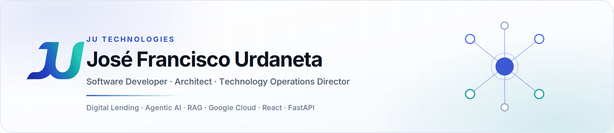

  

<a href="README.md">Español</a> · <b>English</b>

# Hi, I'm José Francisco Urdaneta

Software Developer · Architect · Technology Operations Director and Delivery

Writing software since 2006: .NET and Web Services, then native mobile banking on Play Store and App Store, and today digital lending platforms and AI systems with RAG and agents on Google Cloud. I design the architecture, write the code, build the team and take it to production.

🌐 <a href="https://jutechnologies.com">Website</a> |
💼 <a href="https://www.linkedin.com/in/jos%C3%A9-francisco-urdaneta-98914095/">LinkedIn</a> |
🥃 <a href="https://zonabarrica-1541.web.app/">Zona Barrica</a> |
🏃 <a href="https://runcoach-ai-496921.web.app/login">RunCoach AI</a> |
📧 <a href="mailto:jfurdaneta@gmail.com">Email</a>

## 🎯 What I Do

- 💻 Full-stack development, 20+ years: .NET and SQL Server, Java, native mobile, Python, React
- 🤖 Agentic AI for regulated domains: multi-agent orchestration with rules, RAG and SLM
- 🧠 RAG and knowledge engineering: ontologies, ChromaDB, embeddings, retrieval evaluation
- 💳 Digital lending platforms: origination, risk decisioning, production rollout
- 🪪 Digital onboarding: biometrics, OCR, documentary validation, e-signature
- ☁️ Google Cloud, Firebase & AWS: microservices, Cloud Run, Firestore, Vertex AI
- 📊 Data lake analytics and Power BI that close measurable operational gaps
- 🎓 MSc in ICT at Universidad del Zulia, applied AI research

## 📈 By the Numbers

| | |
|---|---|
| **20+ yrs** | writing software, from .NET Web Services in 2006 to RAG systems today |
| **+82%** | credit operations scaled, while support tickets fell **-83%** in the same cycle |
| **10** | clients taken to production across Colombia and Peru |
| **20** | people led across implementation, web, backend, rules engine, mobile, PM and support |
| **USD 2M** | transacted per day on the digital banking platform I took to production |

## 🚀 Tech Stack

### 🤖 AI & Intelligent Systems

### 🧠 RAG & Knowledge Engineering

### ☁️ Cloud & DevOps

### 🛠 Backend

### 🗄 Databases & Data

### 🌐 Frontend

### 📱 Native Mobile

### 💻 Tools

### 🏦 Fintech Domain

## 📂 Featured Projects

### 🥃 [Zona Barrica](https://zonabarrica-1541.web.app/): AI Sommelier

Cloud-native whisky collection and tasting platform where the **AI engine is the product**. It builds a palate DNA from a 14-attribute sensory profile computed by the tasting log itself, then uses **Gemini 2.5 Flash on Vertex AI** to generate personalised recommendations, a Discovery Index and conversational chat. Three different scoring modes are normalised to a single scale so the model receives a coherent signal. Four FastAPI microservices on Cloud Run, with a configurable rate limit on AI generation to bound per-user cost.

`Gemini 2.5 Flash` · `Vertex AI` · `React 18` · `FastAPI` · `Cloud Run` · `Firestore` · `Firebase Auth`

### 🏃 [RunCoach AI](https://runcoach-ai-496921.web.app/login): from agent to RAG system

Runner training platform redesigned from a simple agent into a **knowledge-based system**. The original had one hand-coded domain rule and Gemini answering from parametric knowledge, so nothing was traceable. The redesign interposes a full knowledge layer: domain ontology and taxonomy, structural chunking with metadata propagation, 768-dimension `text-embedding-004` embeddings, and a **ChromaDB** vector store with HNSW indexing and cosine similarity. At runtime the agent synthesises the query, retrieves top-k with metadata filtering, builds a grounding prompt and **validates citations before answering**: a hallucinated citation is detected and discarded. Ingestion is idempotent by content hash.

| Retrieval metric | Value |
|---|---|
| Precision@3 | **0.815** |
| Recall@3 · MRR | **0.944** |
| Hit rate | 17/18 |
| Citation precision | **1.000** |

`RAG` · `ChromaDB` · `text-embedding-004` · `Gemini 2.5 Flash` · `LangChain text splitters` · `FastAPI` · `Cloud Run`

### 🤖 PulseAI *(4Told Fintech)*

Agentic AI platform for regulated finance and insurance. Multi-agent architecture (receptionist, orchestrator, specialist agents) combining business-rule reasoning (Drools), RAG and small language models. Multiple LLM engines behind one orchestration layer, operating omnichannel across CRM, core banking, mobile banking, web and WhatsApp.

`Multi-agent` · `Drools` · `RAG` · `SLM` · `OpenAI` · `Gemini` · `DeepSeek`

### 📦 [Los Líderes Encomiendas](https://www.loslideresencomiendas.com/)

Cross-border Colombia-Venezuela logistics operation digitised end to end: a multi-role PWA for operations and a separately deployed commercial landing optimised for conversion and SEO.

`React 19` · `Supabase` · `Tailwind CSS 4` · `TanStack Query` · `Zustand` · `Railway`

### 🔍 Design & SEO: [Caprichos Makeup](https://propuesta-caprichos.web.app/demo-caprichos) · [Tu Rincón Efímero](https://tu-rincon-efimero.web.app/)

Sites that look good and also show up on Google. At Caprichos Makeup: a SPA Google could not
index, a poor mobile experience where over three quarters of traffic arrives on phones, and
product presentation below the visual standard of Instagram. The answer was a mobile-first
redesign, an indexable architecture, optimised imagery and a component base that also serves
Alma Beauty. Tu Rincón Efímero is the second example of the same work.

`Technical SEO` · `SSR / indexability` · `Mobile-first` · `Web performance` · `Open Graph` · `Schema.org`

### 🌐 [jutechnologies.com](https://jutechnologies.com)

This portfolio: bilingual ES/EN, no UI framework, deployed on Railway.

`React` · `Vite`

## 🎓 Education & Research

- **MSc in Information and Communication Technologies**, Universidad del Zulia *(in progress, expected 2027)*
- **BSc in Computer Science**, Universidad del Zulia *(2007)*
- Current research: intelligent agents for training prescription, grounding a production system in peer-reviewed literature rather than the other way around

## 🌎 Let's Connect

Open to remote technology and operations leadership roles across LatAm, and to consulting engagements in digital lending, applied AI and automation.

📧 [jfurdaneta@gmail.com](mailto:jfurdaneta@gmail.com) · 📱 [+57 312 750 7463](https://wa.me/573127507463) · 📍 Barranquilla, Colombia

