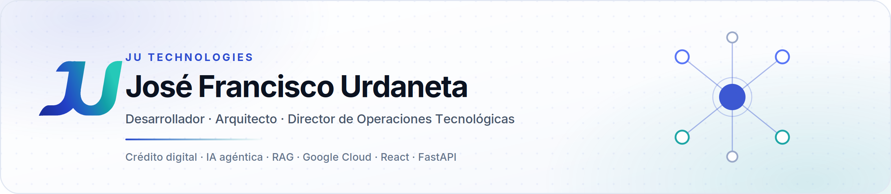

  

<b>Español</b> · <a href="README.en.md">English</a>

# Hola, soy José Francisco Urdaneta

Desarrollador · Arquitecto · Director de Operaciones Tecnológicas y Delivery

Escribo software desde 2006: empecé en .NET y Web Services, llevé banca móvil nativa a Play Store y App Store, y hoy construyo plataformas de crédito digital y sistemas de IA con RAG y agentes sobre Google Cloud. Diseño la arquitectura, escribo el código, armo el equipo y lo llevo a producción.

🌐 <a href="https://jutechnologies.com">Sitio web</a> |
💼 <a href="https://www.linkedin.com/in/jos%C3%A9-francisco-urdaneta-98914095/">LinkedIn</a> |
🥃 <a href="https://zonabarrica-1541.web.app/">Zona Barrica</a> |
🏃 <a href="https://runcoach-ai-496921.web.app/login">RunCoach AI</a> |
📧 <a href="mailto:jfurdaneta@gmail.com">Correo</a>

## 🎯 A qué me dedico

- 💻 Desarrollo full-stack, más de 20 años: .NET y SQL Server, Java, móvil nativo, Python, React
- 🤖 IA agéntica para dominios regulados: orquestación multi-agente con reglas, RAG y SLM
- 🧠 RAG e ingeniería del conocimiento: ontologías, ChromaDB, embeddings, evaluación de recuperación
- 💳 Plataformas de crédito digital: originación, decisión de riesgo, puesta en producción
- 🪪 Onboarding digital: biometría, OCR, validación documental, firma electrónica
- ☁️ Google Cloud, Firebase y AWS: microservicios, Cloud Run, Firestore, Vertex AI
- 📊 Analítica sobre lago de datos y Power BI que cierran brechas operativas medibles
- 🎓 Maestría en TIC en la Universidad del Zulia, investigación en IA aplicada

## 📈 En números

| | |
|---|---|
| **+20 años** | escribiendo software, desde Web Services en .NET en 2006 hasta sistemas RAG hoy |
| **+82%** | escalé las operaciones de crédito, mientras los tickets de soporte bajaban **-83%** en el mismo ciclo |
| **10** | clientes puestos en producción en Colombia y Perú |
| **20** | personas lideradas entre implementación, web, backend, motor de reglas, mobile, PM y soporte |
| **USD 2M** | transaccionados por día en la banca digital que llevé a producción |

## 🚀 Stack tecnológico

### 🤖 IA y Sistemas Inteligentes

### 🧠 RAG e Ingeniería del Conocimiento

### ☁️ Cloud y DevOps

### 🛠 Backend

### 🗄 Bases de Datos y Analítica

### 🌐 Frontend

### 📱 Móvil Nativo

### 💻 Herramientas

### 🏦 Dominio Fintech

## 📂 Proyectos destacados

### 🥃 [Zona Barrica](https://zonabarrica-1541.web.app/): Sommelier IA

Plataforma cloud-native de colección y cata de whisky donde **el motor de IA es el producto**. Construye el ADN del paladar a partir de un perfil sensorial de 14 atributos que la propia bitácora de catas calcula, y con **Gemini 2.5 Flash sobre Vertex AI** genera recomendaciones personalizadas, un Índice de Descubrimiento y chat conversacional. Tres modos distintos de calificar se normalizan a una escala única para que el modelo reciba una señal coherente. Cuatro microservicios FastAPI en Cloud Run, con rate-limit configurable sobre la generación de IA para acotar el costo por usuario.

`Gemini 2.5 Flash` · `Vertex AI` · `React 18` · `FastAPI` · `Cloud Run` · `Firestore` · `Firebase Auth`

### 🏃 [RunCoach AI](https://runcoach-ai-496921.web.app/login): de agente a sistema RAG

Plataforma de entrenamiento de corredores rediseñada de agente simple a **sistema basado en conocimiento**. La versión original tenía una sola regla de dominio escrita a mano y Gemini respondía desde su conocimiento paramétrico, así que nada era trazable. El rediseño interpone una capa de conocimiento completa: ontología y taxonomía del dominio, chunking estructural con propagación de metadata, embeddings `text-embedding-004` de 768 dimensiones, y un almacén vectorial en **ChromaDB** con índice HNSW y similitud coseno. En runtime el agente sintetiza la consulta, recupera top-k con filtrado por metadata, construye el prompt de grounding y **valida las citas antes de responder**: una cita alucinada se detecta y se descarta. La ingesta es idempotente por hash de contenido.

| Métrica de recuperación | Valor |
|---|---|
| Precision@3 | **0.815** |
| Recall@3 · MRR | **0.944** |
| Tasa de acierto | 17/18 |
| Precisión de citación | **1.000** |

`RAG` · `ChromaDB` · `text-embedding-004` · `Gemini 2.5 Flash` · `LangChain text splitters` · `FastAPI` · `Cloud Run`

### 🤖 PulseAI *(4Told Fintech)*

Plataforma de IA agéntica para finanzas y seguros regulados. Arquitectura multi-agente (recepcionista, orquestador, agentes especialistas) que combina razonamiento por reglas de negocio (Drools), RAG y modelos pequeños. Varios motores LLM bajo una sola capa de orquestación, operando de forma omnicanal sobre CRM, core bancario, banca móvil, web y WhatsApp.

`Multi-agente` · `Drools` · `RAG` · `SLM` · `OpenAI` · `Gemini` · `DeepSeek`

### 📦 [Los Líderes Encomiendas](https://www.loslideresencomiendas.com/)

Operación logística transfronteriza Colombia-Venezuela digitalizada de punta a punta: una PWA multi-rol para la operación y una landing comercial desplegada por separado, optimizada para conversión y SEO.

`React 19` · `Supabase` · `Tailwind CSS 4` · `TanStack Query` · `Zustand` · `Railway`

### 🔍 Diseño y SEO: [Caprichos Makeup](https://propuesta-caprichos.web.app/demo-caprichos) · [Tu Rincón Efímero](https://tu-rincon-efimero.web.app/)

Sitios que se ven bien y además aparecen en Google. En Caprichos Makeup: una SPA que Google no podía indexar, experiencia móvil deficiente en un mercado donde más de tres cuartos del tráfico llega por celular, y presentación de producto por debajo del estándar visual de Instagram. La respuesta fue rediseño mobile-first, arquitectura indexable, imágenes optimizadas y una base de componentes que sirve también para Alma Beauty. Tu Rincón Efímero es el segundo ejemplo del mismo trabajo.

`SEO técnico` · `SSR / indexabilidad` · `Mobile-first` · `Rendimiento web` · `Open Graph` · `Schema.org`

### 🌐 [jutechnologies.com](https://jutechnologies.com)

Este portafolio: bilingüe ES/EN, sin framework de UI, desplegado en Railway.

`React` · `Vite`

## 🎓 Formación e investigación

- **Magíster en Tecnologías de la Información y Comunicación**, Universidad del Zulia *(en curso, estimado 2027)*
- **Licenciado en Computación**, Universidad del Zulia *(2007)*
- Investigación actual: agentes inteligentes para prescripción de entrenamiento, fundamentando un sistema en producción con literatura arbitrada y no al revés

## 🌎 Hablemos

Abierto a roles remotos de dirección técnica y de operaciones en LatAm, y a proyectos de consultoría en crédito digital, IA aplicada y automatización.

📧 [jfurdaneta@gmail.com](mailto:jfurdaneta@gmail.com) · 📱 [+57 312 750 7463](https://wa.me/573127507463) · 📍 Barranquilla, Colombia

<!--
**jfurdaneta/jfurdaneta** es un repositorio ✨ especial ✨: su README.md aparece en tu perfil de GitHub.
-->
